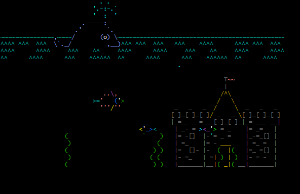

# Telnet Client
This Telnet client is a simple command-line application that allows users to connect to Telnet servers, send commands, and receive responses. It supports both direct connections using IP addresses or domain names and the ability to cache and manage previous connections. The client is written in Java and includes basic functionality to open and close connections, manage a connection cache, and provide helpful command-line instructions.

## How to Run
- **Prerequisites**: You should have Java Development Kit (JDK) already installed
- **To compile**: ```javac *.java```
- **To run**: ```java TelnetClient```

## Examples of Usage
- There are various public Telnet servers where you can test this application. Some of them can be found [here](https://store.chipkin.com/articles/telnet-list-of-telnet-servers) or [here](https://telnet.org/htm/places.htm). **Note that some of them may no longer be active**.
- One still-active server is **telehack.com**. You can connect to it like this:
    ```
    telnet: open telehack.com
    ```
    Telehack offers various features you can explore. One example is the **aquarium** \
     \
    **Note**: Animations, such as those shown in the picture, will not be displayed properly in terminals like the default Windows Command Prompt, which does not fully support ANSI escape sequences. To avoid display issues, it is recommended to use a terminal that supports ANSI escape sequences, such as **Cmder**, **Git Bash**, or **Windows Terminal**.